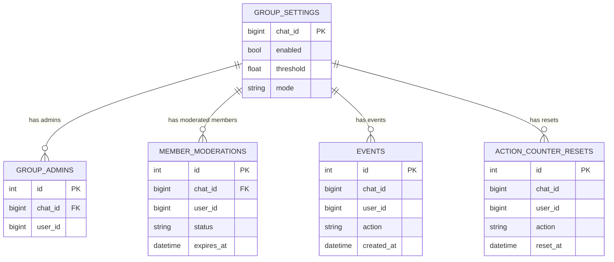

```mermaid
erDiagram
    GROUP_SETTINGS ||--o{ GROUP_ADMINS : "has admins"
    GROUP_SETTINGS ||--o{ MEMBER_MODERATIONS : "has moderated members"
    GROUP_SETTINGS ||--o{ EVENTS : "has events"
    GROUP_SETTINGS ||--o{ ACTION_COUNTER_RESETS : "has resets"

    GROUP_SETTINGS {
        bigint chat_id PK
        bool enabled
        float threshold
        string mode
    }

    GROUP_ADMINS {
        int id PK
        bigint chat_id FK
        bigint user_id
    }

    MEMBER_MODERATIONS {
        int id PK
        bigint chat_id FK
        bigint user_id
        string status
        datetime expires_at
    }

    EVENTS {
        int id PK
        bigint chat_id
        bigint user_id
        string action
        datetime created_at
    }

    ACTION_COUNTER_RESETS {
        int id PK
        bigint chat_id
        bigint user_id
        string action
        datetime reset_at
    }

```